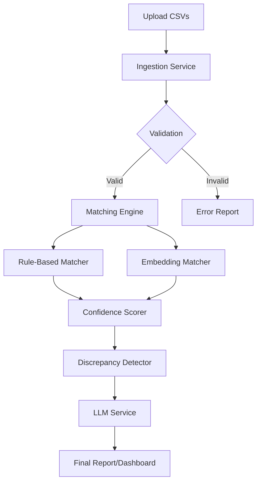

# Financial Reconciliation Workflow & Architecture

## 1. Overview

The Financial Reconciliation Agent automates the process of matching bank statements with internal ledgers. It uses a multi-stage pipeline involving parsing, fuzzy matching, vector embeddings, and LLM-based discrepancy analysis.

## 2. System Architecture

## 3. Workflow Steps

### Step 1: Ingestion (`ingestion/`)

- **Inputs**: Bank Statement CSV, Ledger CSV.
- **Process**:
  - Normalizes dates (ISO 8601) and amounts (Decimal).
  - Cleans whitespace and special characters from descriptions.
- **Key Files**: `parsers.py`, `normalizers.py`

### Step 2: Matching (`matching/`)

The core engine `MatchingEngine` uses a hybrid approach:

1.  **Hard Filters**: Candidates must be within `date_window_days` (default 7).
2.  **Rule-Based Matching** (`rules.py`):
    - Exact amount matches + Exact date matches = High Score.
    - Partial amount matches (fuzzy) or date ranges = Lower Score.
3.  **Semantic Matching** (`embeddings.py`):
    - **Model**: `all-mpnet-base-v2` (previously `all-MiniLM-L6-v2`).
    - **Process**: Converts transaction descriptions into 768-dimensional vectors.
    - **Search**: Uses **FAISS** (Facebook AI Similarity Search) to find semantically similar descriptions (e.g., "UBER \*TRIP" similar to "Uber Rides").
4.  **Scoring** (`scorer.py`):
    - Combines Rule Score + Semantic Score into a final `confidence` (0.0 to 1.0).
    - Threshold: Matches with confidence > `min_confidence` (default 0.6) are accepted.

### Step 3: Discrepancy Detection (`discrepancy/`)

Identify transactions that failed to match:

- **Missing in Ledger**: Exists in Bank but not Ledger.
- **Missing in Bank**: Exists in Ledger but not Bank.
- **Amount Mismatch**: Matched but amounts differ slightly.

### Step 4: LLM Explanation (`llm_service/`)

Uses **OpenAI GPT-4o-mini** to explain discrepancies.

- **Input**: Discrepancy details (e.g., "Amount differs by $0.05", "Description: AMAZON MKT").
- **Output**: Natural language explanation (e.g., "Exchange rate difference" or "Sales tax variance") and suggested action.

## 4. Key Technologies

- **Backend**: FastAPI
- **Database**: SQLite (Async SQLAlchemy)
- **Vector Search**: FAISS + SentenceTransformers
- **LLM**: OpenAI GPT-4o-mini
- **Frontend**: Next.js + Tailwind CSS

## 5. Accuracy Factors

Accuracy depends on:

1.  **Embedding Model**: `all-mpnet-base-v2` provides better semantic understanding than lighter models.
2.  **Matching Algorithm**: Current "Greedy" matching can be improved to "Global" matching (Hungarian Algorithm) to resolve conflicts.
3.  **LLM Context**: Enhancing prompts with historical data (RAG) improves explanation quality.
